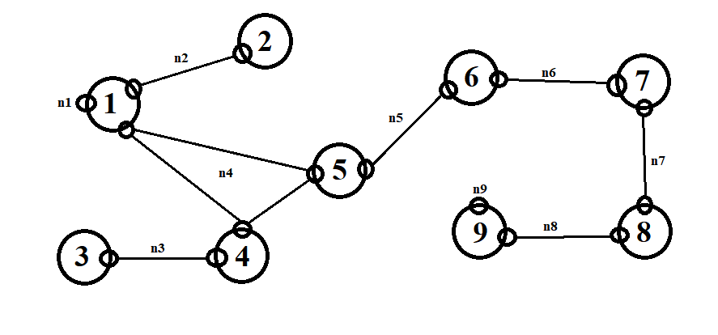

# P2P File Sharing Application

## Overview
This project implements a Peer-to-Peer (P2P) file sharing application. The system allows peers to discover each other, exchange file metadata, and transfer files in a decentralized network. The application leverages Java for its core logic, Java Swing for the graphical user interface (GUI), and Docker for deployment and testing across multiple simulated peers.

---

## Features
- **File Sharing**:
  - Share files across peers.
  - Exclude specific files or directories from sharing.
- **File Downloading**:
  - Search for available files in the network.
  - Restrict downloads based on file masks.
  - Download files in chunks from multiple peers.
- **Network Discovery**:
  - Broadcast and response mechanisms for peer discovery.
  - Dynamic routing through discovered peers.
- **Decentralized Operation**:
  - No central server; peers communicate directly.
  - Automatic route calculation and message forwarding.
- **GUI Support**:
  - User-friendly interface for managing shared files and downloads.
  - Visual representation of connected peers.
- **Dockerized Deployment**:
  - Simulate a multi-peer network using Docker containers.

---

## Project Structure

### Core Modules
1. **File Management**:
   - `FileManager.java`: Handles file chunking, saving, merging, and listing shared files.
   - `PeerFileMetadata.java`: Represents metadata for shared files (e.g., filename, size, hash).

2. **Network and Communication**:
   - `BroadcastManager.java`: Manages peer discovery through broadcast messages.
   - `DiscoveryMessage.java`: Tracks routing and TTL (time-to-live) for discovery messages.
   - `Peer.java` & `PeerNetworkInterface.java`: Represent peers and their network interfaces.
   - `FileTransferManager.java`: Handles file chunk requests and transfers between peers.
   - `NetworkUtils.java`: Provides utility functions for network operations (e.g., subnet matching).

3. **Message Handling**:
   - `Message.java`: Interface for various message types.
   - `FileChunkMessage.java`: Encapsulates a file chunk and metadata for transfer.
   - `PeerFileMetadataRequestMessage.java`: Requests specific file chunks from a peer.

4. **GUI Components**:
   - `MainFrame.java`: Main application window.
   - `FilesPanel.java`: Interface for managing shared files and exclusions.
   - `DownloadPanel.java`: Interface for managing downloads and monitoring progress.
   - `GUIUtils.java`: Utility functions for GUI components.

5. **Application Entry Point**:
   - `App.java`: Initializes the application and manages thread execution.

### Docker Setup
The project includes a Docker-based setup to simulate a multi-peer network. The `docker-compose.yml` file defines multiple peers connected through overlapping networks.

Below is a visual representation of the Docker network and peer setup:



- **`docker-compose.yml`**:
  - Defines multiple peer containers and their network connections.
  - Simulates a realistic P2P network using Docker networks.
- **`Dockerfile`**:
  - Builds the Java application environment.
- **`Makefile`**:
  - Simplifies Docker build and run commands.

---

## Installation and Setup

### Prerequisites
- **Java 17**
- **Docker and Docker Compose**

### Running with Makefile
 - Start/Restart the docker containers and networks:
   ```bash
   make rebuild
   ```
 - Clean up unused docker containers and networks:
   ```bash
   make clean
   ```

### Running Without Makefile
1. Compile source codes.
2. Execute the application:
   ```bash
   java -cp out com.github.fevzibabaoglu.App
   ```

---

## Usage

### GUI Application
1. **Launch the Application**:
   - Run the main class.
2. **Set Up Shared Files**:
   - Configure the source and destination folder in the `Files` panel.
   - Add exclusions if needed.
3. **Search and Download Files**:
   - Use the `Download` panel to browse available files.
   - Right-click on a file and select `Download`.

### Docker Simulation
- Each container represents a peer.
- Files shared by peers are accessible through the Docker volumes configured in the `docker-compose.yml` file.
- Observe the peer discovery process in the logs.

---

## Technical Details

### Networking
- **Broadcast Mechanism**:
  - `BroadcastManager` broadcasts `DiscoveryMessage` to find peers.
  - Forwarding ensures the message reaches peers within the TTL.
- **File Transfer**:
  - File chunks are transferred using `FileChunkMessage`.
  - Chunk requests are managed through `PeerFileMetadataRequestMessage`.

### Multithreading
- Separate threads handle:
  - Broadcasting and listening for discovery messages.
  - File transfer requests and responses.

### Docker Networks
- Simulates a P2P network with overlapping subnets.
- Each peer connects to multiple networks to mimic real-world scenarios.

---

## License
This project is open-source and released under the [MIT License](LICENSE).
